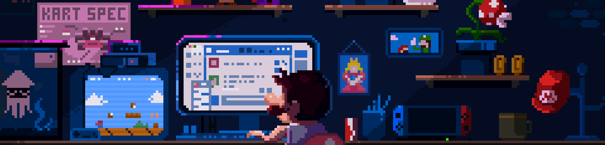

<div align="center">


<br/>

<a href="https://radar-ai-launch.vercel.app/">
  
</a>
<a href="https://lakshay-portfolio-2026.vercel.app/">
  
</a>
<a href="https://www.linkedin.com/in/lakshay-meghlan-77512321b/">
  
</a>
<a href="https://x.com/lakshay_meghlan">
  
</a>

</div>

---

## ◈ System Identity

```ts
const Lakshay = {
  role: "AI Full Stack Engineer",

  building: "Radar — AI Startup Ecosystem",

  thesis:
    "Software should execute intent — not demand interaction.",

  mission:
    "Building India's YC — AI-native, real-time, open"
}
```

---

## ◈ Radar

<div align="center">

<a href="https://radar-ai-launch.vercel.app/">
  
</a>

</div>

### What I’m building

* AI startup discovery layer
* Founder + builder ecosystem
* Conversational workflows
* Agent-based execution system

---

## ◈ Vision

User → *intent*
System → *execution*

No forms. No dashboards. No friction.

---

## ◈ Stack

<div align="center">


</div>

---

## ◈ Metrics

<div align="center">


</div>

---

## ◈ Runtime

```bash
agents            → building
whatsapp_layer    → integrating
ecosystem_graph   → evolving
execution_engine  → loading...
```

---

## ◈ Connect

<div align="center">

<a href="https://radar-ai-launch.vercel.app/">Radar</a> • <a href="https://lakshay-portfolio-2026.vercel.app/">Portfolio</a> • <a href="https://www.linkedin.com/in/lakshay-meghlan-77512321b/">LinkedIn</a> • <a href="https://x.com/lakshay_meghlan">X</a>

</div>

---

<div align="center">

**Intent → Agents → Execution**

</div>
