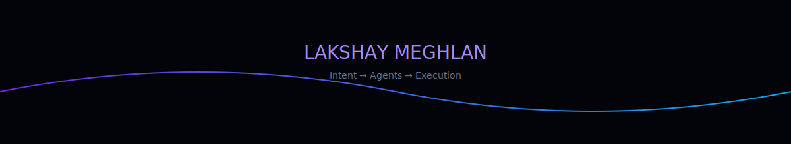

<div align="center">



<br/>


<br/>

<a href="https://radar-ai-launch.vercel.app/">
  
</a>
<a href="https://lakshay-portfolio-2026.vercel.app/">
  
</a>
<a href="https://www.linkedin.com/in/lakshay-meghlan-77512321b/">
  
</a>
<a href="https://x.com/lakshay_meghlan">
  
</a>

</div>

---

## ◈ System Identity

```ts
const system = {
  name: "Lakshay Meghlan",
  role: "AI Full Stack Engineer",

  building: "Radar — AI Startup Ecosystem",

  thesis:
    "Software should not be used.\nIt should execute intent.",

  direction:
    "Building India's YC — AI-native, real-time, open"
}
```

---

## ◈ Radar

<details>
<summary><b>Expand → Architecture & Vision</b></summary>

<br/>

### Layer 1 → Signal

Tracking real AI + startup movement

### Layer 2 → Community

Founders, builders, talent — connected

### Layer 3 → Workflow

Posting, hiring, discovery — simplified

### Layer 4 → Agents

Everything becomes automated

---

### End State

User → intent
System → execution

No dashboards. No forms. No friction.

🔗 https://radar-ai-launch.vercel.app/

</details>

---

## ◈ Capabilities

<div align="center">

| System        | Function                |
| ------------- | ----------------------- |
| 🧠 AI Systems | LLMs, agents, workflows |
| ⚡ Full Stack  | Next.js, Node, MongoDB  |
| ☁ Infra       | AWS, Vercel             |
| 🧩 Product    | Startup ecosystems      |

</div>

---

## ◈ Live Metrics

<div align="center">


</div>

---

## ◈ Runtime

```bash
radar_agents        → building
whatsapp_layer      → integrating
ecosystem_graph     → evolving
execution_engine    → coming soon
```

---

## ◈ Interface

<div align="center">

<a href="https://radar-ai-launch.vercel.app/">Radar</a> • <a href="https://lakshay-portfolio-2026.vercel.app/">Portfolio</a> • <a href="https://www.linkedin.com/in/lakshay-meghlan-77512321b/">LinkedIn</a> • <a href="https://x.com/lakshay_meghlan">X</a>

</div>

---

<div align="center">

**Intent → Agents → Execution**

</div>
